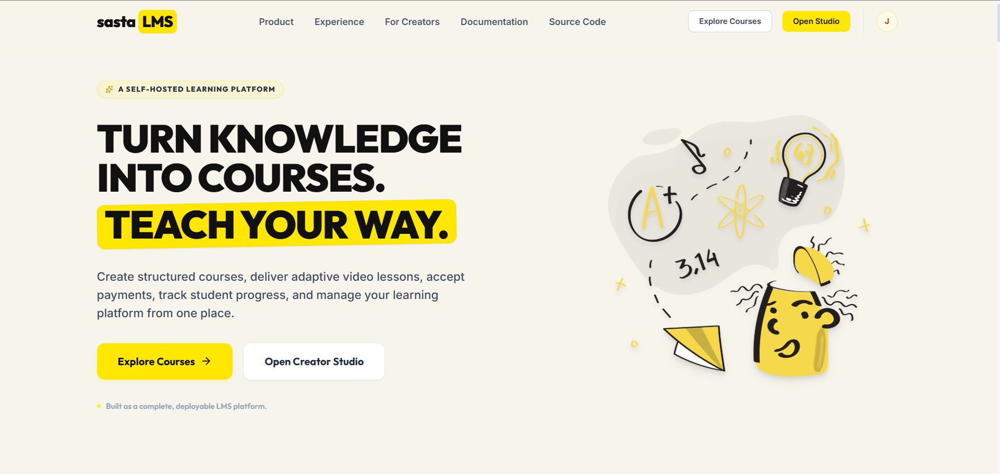
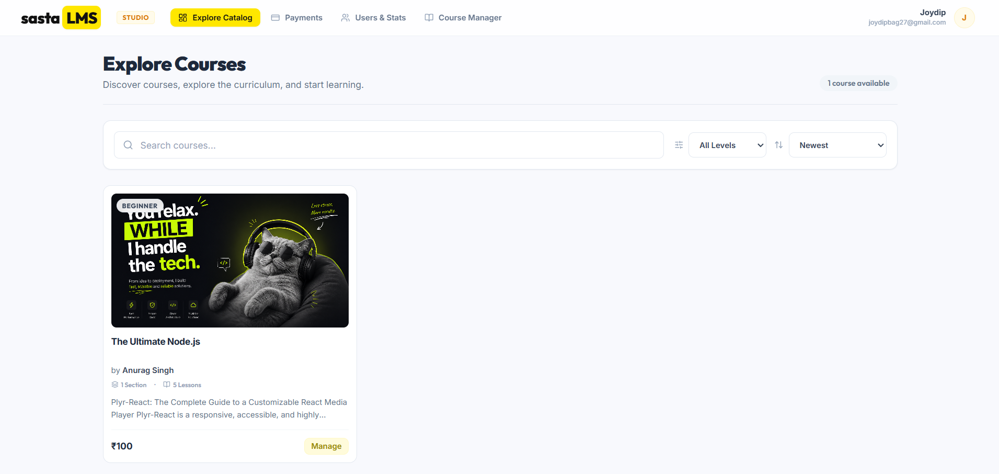
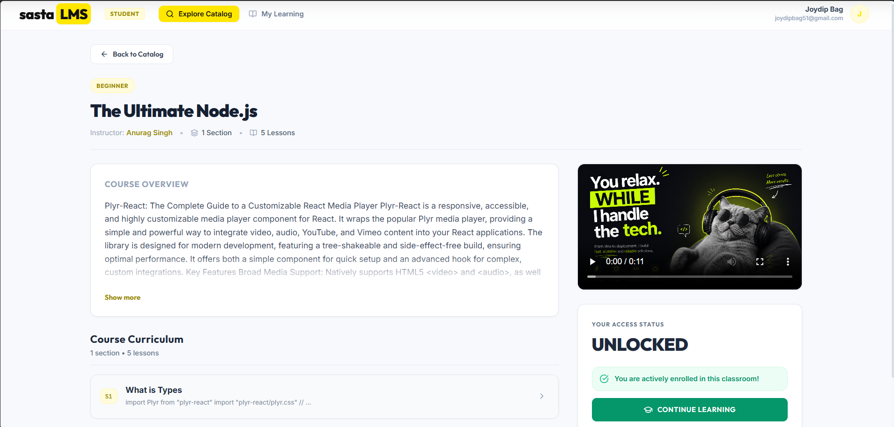
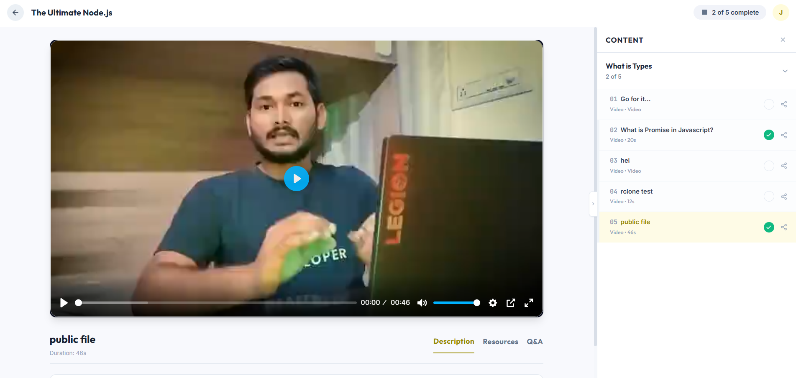
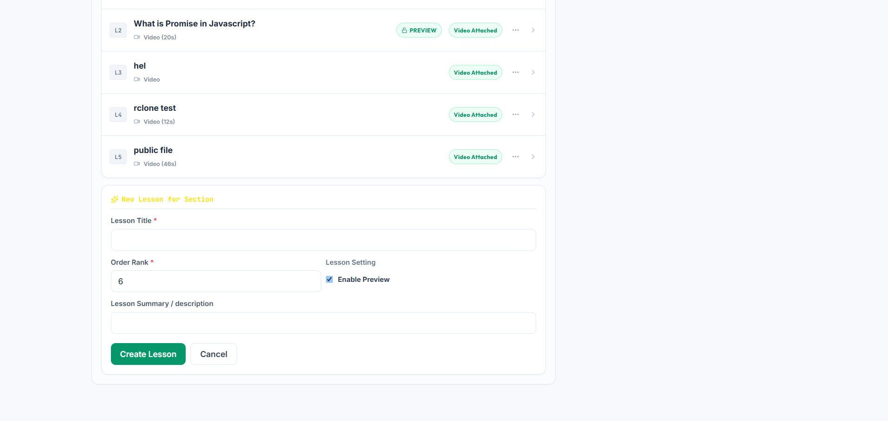
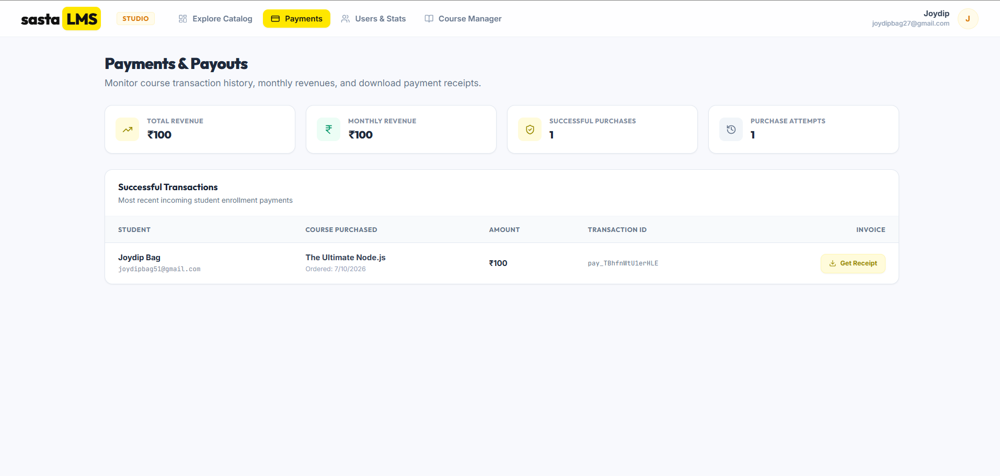
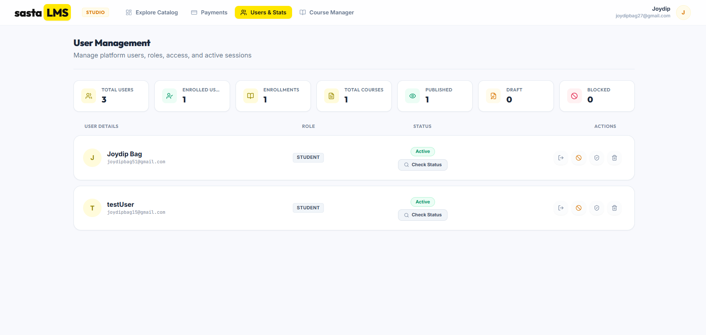
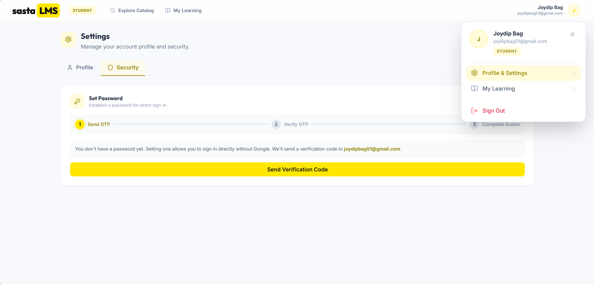
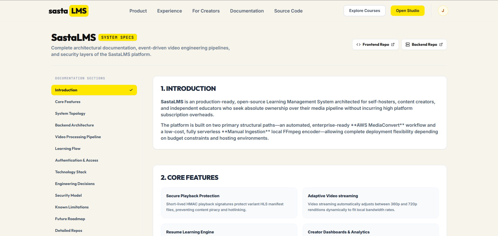
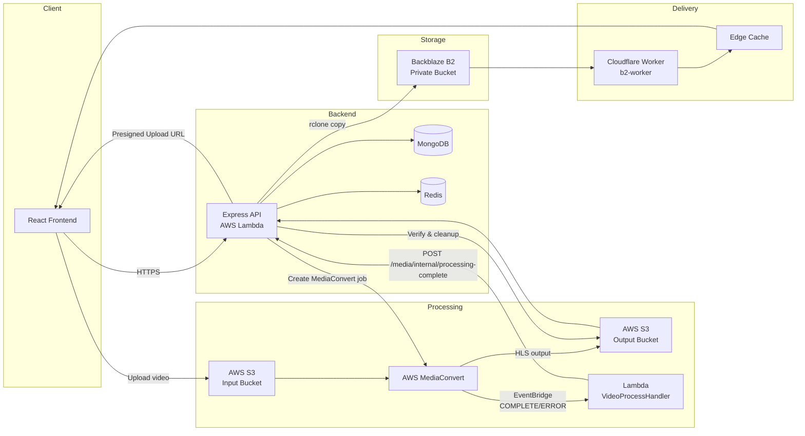

# SastaLMS

A full-stack Learning Management System with cloud-based video processing and delivery pipeline.

Built with React, Express, MongoDB, AWS MediaConvert, Backblaze B2, and Cloudflare Workers.

---

## Live Application & Repositories

- **Frontend Application:** [https://sastalms.sbs](https://sastalms.sbs) (Repository: [sastaLMS-frontend-react](https://github.com/joydipbag27/sastaLMS-frontend-react))
- **Backend API:** [https://api.sastalms.sbs](https://api.sastalms.sbs) (Repository: [sastaLMS-backend](https://github.com/joydipbag27/sastaLMS-backend))

---

## Screenshots

### 🖥️ Student Experience

#### Landing Page
Beautiful, modern hero section welcoming learners.


---

#### Course Catalog & Course Details
Browse structured course cards and explore section lists, course syllabus, and pricing.
<p align="center">
  
  
</p>

---

#### Learning Interface & Video Player
Adaptive HLS video player with quality switching, sidebar navigation, and progress persistence.


---

### 🛠️ Creator Dashboard

#### Course Management
Comprehensive control center for creators to manage sections, lessons, and course publication.


---

#### Analytics & Payments
Track successful payments, view course performance, and monitor revenue in real time.


---

#### User Management
Detailed administration panel to promote users, manage active sessions, block/unblock, and delete accounts.


---

### ⚙️ User Settings & API Docs

#### Profile & Settings
Customize student and creator profiles.


---

#### Interactive API Documentation
Rich documentation layout for developers and admins.


---

## Overview

SastaLMS enables creators to build structured courses with sections and lessons, and students to enroll, watch video content, and track progress.

There are two user roles:

- **STUDENT** — Browse the course catalog, enroll in courses (free or paid via Razorpay), watch video lessons, track learning progress.
- **CREATOR** — All student capabilities plus create and manage courses, sections, lessons, upload video thumbnails and trailers, manage users, and view payment analytics.

The project's technical focus is a production-grade video processing and delivery pipeline: creators upload raw video files, which are transcoded to adaptive HLS streams via AWS MediaConvert, transferred to Backblaze B2 for long-term storage, and delivered through Cloudflare Workers with token-based access control.

---

## Key Features

### Authentication and Authorization

- Email + password registration and login with bcryptjs hashing.
- Google OAuth login via ID token verification (`google-auth-library`).
- Session-based authentication using signed cookies and Redis storage.
- OTP verification flow for email confirmation and password resets (via Resend).
- Role-based access control with `STUDENT` and `CREATOR` roles, enforced by middleware.
- Lesson-level access control middleware enforcing Creator → Preview → Enrolled hierarchy.
- Media playback token generation (HMAC-SHA256 signed, short-lived) for video URL security.

### Course Management

- Full CRUD for courses, sections, and lessons.
- Courses support `Draft` / `Published` status with dedicated publish/unpublish endpoints.
- Publishing validation: requires at least one section, each section has at least one lesson, each lesson has a video attached.
- Cursor-based pagination on list endpoints.
- Course thumbnails and trailers with presigned upload URLs.
- Cascading delete: removing a course deletes its sections, lessons, progress records, and associated media from storage.
- Automatic section and lesson count tracking on courses.

### Learning Experience

- Course catalog browsing with pagination (guest-accessible).
- Free enrollment and paid checkout via Razorpay (order creation + webhook confirmation).
- Enrollment polling flow for immediate post-payment access.
- Structured classroom view: section-by-section lesson navigation with inline per-lesson progress.
- HLS video playback via Video.js with quality level selection (360p / 720p).
- Debounced progress saving (playback position, completion status, watch duration).
- Course-wide progress percentage calculation.
- Draft-course handling: enrolled students see unavailable course banners with disabled playback.

### Media Processing and Delivery

- Signed presigned-URL uploads directly to an AWS S3 input bucket.
- AWS Elemental MediaConvert transcoding to HLS (360p + 720p renditions, 6-second segments).
- Event-driven completion notification via EventBridge and a Lambda callback.
- S3-to-Backblaze B2 transfer using rclone with multi-round retry logic.
- B2 content verification before marking media as `READY` (playlist presence, MIME types, segment integrity, duration calculation).
- Two-phase S3 cleanup: confirmed objects only, then input video.
- Cloudflare Worker delivery layer with HMAC token verification, HLS manifest rewriting, and edge caching for `.ts` segments.
- Manual ingestion pipeline: FFmpeg + rclone local processing for low-cost offline transcoding.
- Transfer repair endpoint for `COPY_PENDING` media with targeted per-object retry.

### Creator Analytics and User Management

- Paginated user listing.
- Session inspection and force-logout for any user.
- User block/unblock.
- Student-to-creator promotion.
- User account deletion.
- Payment dashboard: summary stats, revenue by course, successful payment records, per-payment invoice retrieval.

---

## System Architecture



The frontend communicates with the Express API (deployed on AWS Lambda via Serverless Framework). Video uploads go directly from the browser to an S3 input bucket via presigned URLs. MediaConvert transcodes raw uploads to HLS, EventBridge notifies a Lambda callback, and the backend copies the output to Backblaze B2. Media is served through a Cloudflare Worker that enforces per-request token authentication and caches segments at the edge.

---

## Video Processing Pipeline

1. Creator uploads a video to a lesson via the frontend. The backend creates a `Media` document (`status: UPLOADING`) and returns a presigned S3 PUT URL.
2. The browser uploads the raw video directly to the `MEDIACONVERT_INPUT_BUCKET`.
3. The backend confirms the upload (size and MIME type verification via `HeadObjectCommand`), associates the media with the lesson, creates an AWS Elemental MediaConvert job, and sets status to `PROCESSING`.
4. MediaConvert reads from the input bucket and writes HLS output (360p + 720p, 6s segments) to the `MEDIACONVERT_OUTPUT_BUCKET`.
5. EventBridge detects the job state change (`COMPLETE` or `ERROR`) and invokes the `videoProcessHandler` Lambda.
6. The Lambda sends a webhook (`POST /media/internal/processing-complete`) to the backend with the job result.
7. On success, the backend runs the rclone transfer pipeline: bulk copy of the HLS output from S3 to Backblaze B2, with per-object retry rounds for any failed files.
8. After transfer, the backend verifies B2 content: master playlist existence, Content-Type headers (playlists and segments), segment integrity, total folder size, and HLS duration from playlist `EXTINF` values.
9. If verification passes, the `Media` document is updated to `READY` with calculated size, duration, and MIME type.
10. Confirmed S3 objects are deleted. The original input video is deleted separately after full confirmation.
11. On partial transfer failure (some objects missing in B2), the `Media` status is set to `COPY_PENDING` with a failed-upload log. A repair endpoint (`POST /media/:id/retry-transfer`) allows targeted retry of only the missing objects.
12. Video playback requests are authorized by the backend via HMAC-signed tokens. The Cloudflare Worker verifies the token, rewrites HLS manifest URLs with the active token, and caches `.ts` segments at the edge.

For detailed architecture, see [`Media_Pipeline_Architecture.md`](docs/Media_Pipeline_Architecture.md).

For the manual (offline) ingestion workflow, see [`Manual_Media_Pipeline_Guide.md`](docs/Manual_Media_Pipeline_Guide.md).

---

## Technology Stack

| Layer | Technologies |
|---|---|
| Frontend | React 19, Vite 8, TailwindCSS 3, React Router 7, TanStack React Query 5, GSAP, Framer Motion |
| Video Playback | HLS.js, Video.js 8, videojs-contrib-quality-levels, videojs-hls-quality-selector |
| Backend Runtime | Node.js 22 (ESM), Express 5 |
| Database | MongoDB via Mongoose 8 |
| Session Store | Redis |
| Validation | Zod 4 |
| Authentication | bcryptjs, google-auth-library, signed cookies |
| Email | Resend |
| Payments | Razorpay |
| Media Processing | AWS Elemental MediaConvert |
| Processing Storage | AWS S3 |
| Final Media Storage | Backblaze B2 (S3-compatible) |
| Event Processing | Amazon EventBridge, AWS Lambda |
| Media Delivery | Cloudflare Workers (custom b2-worker) |
| File Transfer | rclone (bundled with Lambda deployment) |
| Deployment | Serverless Framework (backend), AWS S3 static hosting (frontend) |

---

## User Roles

| Role | Capabilities |
|---|---|
| `STUDENT` | Browse course catalog, view course details, enroll in free courses, purchase courses via Razorpay, watch enrolled course lessons, track progress (playback position, completion) |
| `CREATOR` | All STUDENT capabilities plus create/update/delete own courses, sections, and lessons; upload video, thumbnails, and trailers; manage users (view, block, delete, promote to creator); force-logout users; view payment analytics and revenue breakdowns |

The application does not have an `ADMIN` role. All management and analytics operations are gated by the `CREATOR` role.

---

## Project Structure

```
SastaLMS/
├── Frontend/                     # React + Vite SPA (https://github.com/joydipbag27/sastaLMS-frontend-react)
│   ├── src/
│   │   ├── app/                  # Layouts, route guards, providers
│   │   ├── features/             # Auth, courses, learning, media, account
│   │   ├── pages/                # Route entry-points (learner/, creator/, admin/, auth/)
│   │   ├── components/           # Shared UI primitives and blocks
│   │   └── services/             # API client
│   ├── index.html
│   └── package.json
│
└── Backend/                      # Express API (Node.js ESM) (https://github.com/joydipbag27/sastaLMS-backend)
    ├── Controllers/              # Route handlers (auth, course, lesson, media, payment, etc.)
    ├── Models/                   # Mongoose schemas (User, Course, Section, Lesson, Media, etc.)
    ├── Routes/                   # Express route definitions
    ├── middlewares/              # Rate limits and auth/role route guards
    ├── services/                 # MediaConvert, rclone, B2, playback tokens, durations
    ├── config/                   # MongoDB, Redis, S3 clients, role metadata
    ├── lambda/                   # MediaConvert callback handler
    ├── validators/               # Zod schemas
    ├── docs/                     # Documentation and assets
    │   ├── backend_overview.md   # API and backend design docs
    │   ├── Media_Pipeline_Architecture.md # Adaptive streaming architecture
    │   ├── Manual_Media_Pipeline_Guide.md # CLI-based backup ingestion guide
    │   └── sastalms-visuals/     # Application screenshots
    ├── cloudflare/b2-worker/     # Cloudflare Worker for edge delivery and playback tokens
    ├── scripts/                  # DB utilities and user promotions
    ├── app.js                    # App initialization
    ├── server.js                 # Local development runner
    ├── lambda.js                 # AWS Lambda entry wrapper
    ├── serverless.yml            # AWS Serverless config
    ├── .env.example              # Env variable guide
    └── README.md                 # Project README (this file)
```

---

## Getting Started

### Prerequisites

- Node.js 22 or later
- npm
- MongoDB instance (local or Atlas)
- Redis instance (local or cloud)
- Cloud service accounts for full media pipeline functionality:
  - AWS account with S3, MediaConvert, EventBridge, and Lambda access
  - Backblaze B2 account with a bucket
  - Cloudflare account for the delivery Worker
  - Resend API key for transactional emails
  - Razorpay account for payment processing

### Installation

```bash
# Clone the repository
git clone <repository-url>
cd SastaLMS

# Install backend dependencies
cd Backend
npm install

# Install frontend dependencies
cd ../Frontend
npm install
```

### Environment Configuration

Each service requires its own `.env` file:

- **Backend:** Copy `Backend/.env.example` to `Backend/.env.local` and fill in the required values.
- **Frontend:** Create `Frontend/.env.development` with `VITE_API_BASE_URL=http://localhost:3000` (or your backend URL) and `VITE_GOOGLE_CLIENT_ID` if using Google OAuth.

> The media processing pipeline will not function without valid AWS, Backblaze B2, and Cloudflare credentials. The application can be tested with basic features (course CRUD, enrollment) using only MongoDB and Redis.

### Running Locally

```bash
# Terminal 1: Backend
cd Backend
npm run dev

# Terminal 2: Frontend
cd Frontend
npm run dev
```

The backend starts on port 3000 by default (configurable via `PORT` in `.env`).
The frontend starts on `http://localhost:5173` (Vite default).

### Production Build

```bash
# Backend
cd Backend
npm run build     # Installs dependencies for Lambda deployment

# Frontend
cd Frontend
npm run build     # Produces optimized output in Frontend/dist/
```

---

## Environment Variables

The backend uses approximately 30 environment variables. See [`.env.example`](.env.example) for the complete reference with documentation.

Key variable groups:

| Group | Key Variables |
|---|---|
| App | `PORT`, `NODE_ENV`, `CLIENT_URL`, `SESSION_SECRET` |
| Database | `MONGODB_URI` |
| Session | `REDIS_URL` |
| Auth | `GOOGLE_CLIENT_ID` |
| Email | `RESEND_KEY` |
| Payments | `RAZORPAY_KEY_ID`, `RAZORPAY_KEY_SECRET`, `RAZORPAY_WEBHOOK_SECRET` |
| AWS Media | `AWS_REGION`, `MEDIACONVERT_ROLE`, `MEDIACONVERT_ENDPOINT`, `MEDIACONVERT_INPUT_BUCKET`, `MEDIACONVERT_OUTPUT_BUCKET`, `AWS_THUMBNAIL_BUCKET` |
| B2 Storage | `BLACK_BLAZE_ENDPOINT`, `BLACK_BLAZE_REGION`, `BLACK_BLAZE_ACCESS_KEY_ID`, `BLACK_BLAZE_SECRET`, `BUCKET_NAME` |
| Delivery | `CLOUDFLARE_WORKER_URL`, `PLAYBACK_TOKEN_SECRET`, `PLAYBACK_TOKEN_TTL_SECONDS` |
| Transfer | `RCLONE_PATH`, `RCLONE_S3_REMOTE`, `RCLONE_B2_REMOTE`, `RCLONE_TRANSFERS`, `RCLONE_CHECKERS`, `RCLONE_APP_RETRY_ROUNDS` |
| Lambda | `BACKEND_URL`, `LAMBDA_SECRET` |

Frontend environment variables:

| Variable | Purpose |
|---|---|
| `VITE_API_BASE_URL` | Backend API URL |
| `VITE_GOOGLE_CLIENT_ID` | Google OAuth client ID |

---

## API Overview

The backend exposes routes under the following prefixes:

| Prefix | Purpose |
|---|---|
| `/user` | Registration, login, logout, password management |
| `/auth` | OTP verification, Google OAuth |
| `/users` / `/admin` | User management, payment analytics (CREATOR role) |
| `/course` | Course CRUD, thumbnails, trailers, enrollment, publish/unpublish |
| `/section` | Section CRUD scoped to courses |
| `/lesson` | Lesson CRUD, playback tokens, progress tracking |
| `/media` | Video upload, manual ingestion, transfer repair, processing callback |
| `/payment` | Razorpay order creation and webhook |
| `/learning` | Classroom section data and course progress summaries |

See [`backend_overview.md`](docs/backend_overview.md) for the complete route reference with authentication requirements.

---

## Documentation

| Document | Purpose |
|---|---|
| [`backend_overview.md`](docs/backend_overview.md) | Backend architecture, data models, middleware, API routes, and core workflows |
| [`Media_Pipeline_Architecture.md`](docs/Media_Pipeline_Architecture.md) | Technical architecture of the video processing and delivery pipeline |
| [`Manual_Media_Pipeline_Guide.md`](docs/Manual_Media_Pipeline_Guide.md) | Step-by-step guide for the offline FFmpeg + rclone ingestion workflow |

---

## Engineering Decisions

- **Session-based auth over JWT:** Cookie-based signed sessions stored in Redis allow server-side session invalidation (logout-all-devices, force-logout) and avoid token-revocation complexity.
- **Metadata-based media references:** The `Media` model decouples business objects (courses, lessons) from storage URLs. This allows changing storage providers or reorganizing keys without updating course/lesson documents.
- **Presigned uploads:** Video files are uploaded directly from the browser to S3, avoiding backend bandwidth and processing bottlenecks.
- **HLS + adaptive bitrate:** Two renditions (360p @1.2 Mbps, 720p @3.5 Mbps) balance video quality against processing and storage cost. HLS enables segment-level caching and token rewrites.
- **Separate processing and final storage:** S3 handles transient processing artifacts that are deleted after verification. Backblaze B2 serves as the durable, low-cost media origin.
- **Verification before READY:** Media is not marked playable until B2 content is verified (playlists, segments, MIME types, size, duration). This prevents broken streams from reaching students.
- **Cleanup only after verification:** S3 objects are never deleted until they are confirmed present in B2. The two-phase cleanup (confirmed objects, then input video) prevents data loss.
- **rclone for transfer:** A production-grade tool handles parallel transfers, retries, and checksum verification — more robust than SDK-based copy for thousands of small HLS segments.
- **Layer-scoped simplification:** The `ADMIN` role was scoped out during development. All management operations use the `CREATOR` role, which is sufficient for project-scale access control.

---

## Security Considerations

- Session cookies are signed with `SESSION_SECRET` and parsed via `cookie-parser`.
- Video upload URLs are presigned with 1-hour expiry and restricted to a single PUT operation.
- Media playback uses short-lived HMAC-SHA256 signed tokens (default 2-hour TTL) verified by the Cloudflare Worker before serving content.
- The Cloudflare Worker validates token expiry, HMAC signature (constant-time comparison), and `mediaId` match.
- The HLS manifest rewriter injects the active token into every segment URL, maintaining per-request authentication across all stream requests.
- Only `.m3u8` and `.ts` paths under `/videos/` are served by the Worker; all other paths return 404.
- `.ts` segments are cached at the edge with `immutable` cache headers; `.m3u8` manifests are never cached to ensure token freshness.
- Input validation via Zod schemas on all request bodies.
- CORS is configured to accept only the configured `CLIENT_URL` origins.
- Helmet sets secure HTTP headers. Rate limiting protects auth and sensitive endpoints.
- Secrets are injected through environment variables only — no credentials in code or configuration files.

---

## Known Limitations

- The `ADMIN` role is not implemented. All management operations use the `CREATOR` role.
- Transfer repair requires manual invocation via `POST /media/:id/retry-transfer`. Automatic retry is not implemented.
- The application does not have automated test suites (no test scripts are configured in either `package.json`).
- Deployment is manual (Serverless Framework for backend, S3 sync for frontend).
- Classroom error states for unauthorized playback (403/Draft) display basic text alerts rather than styled user-facing messages.
- S3 upload logic for videos and thumbnails uses duplicate, independent implementations.
- Infrastructure is configured for project/demo scale — single-region AWS, basic rate limiting, no CI/CD pipeline.
- Accessibility and responsive design coverage is partial.

---

## Future Improvements

- Automated retry and orchestration for failed media transfers.
- Expanded automated test coverage (unit, integration, E2E).
- Accessibility improvements (ARIA labels, keyboard navigation, screen reader support).
- Observability: structured logging, metrics, request tracing.
- Adaptive streaming enhancements: additional renditions, thumbnail previews, DASH support.
- CI/CD pipeline with automated testing, linting, and deployment.
- Role management UI within the application (currently handled via API/scripts).

---

## Author

**Joydip Bag** (<joydipbag27@gmail.com>)

- GitHub: [joydipbag27](https://github.com/joydipbag27)
- Portfolio: [joydip.in](https://joydip.in)

---

## License

This project is developed as a portfolio and demonstration project. No license is specified. Contact the author for usage inquiries.
